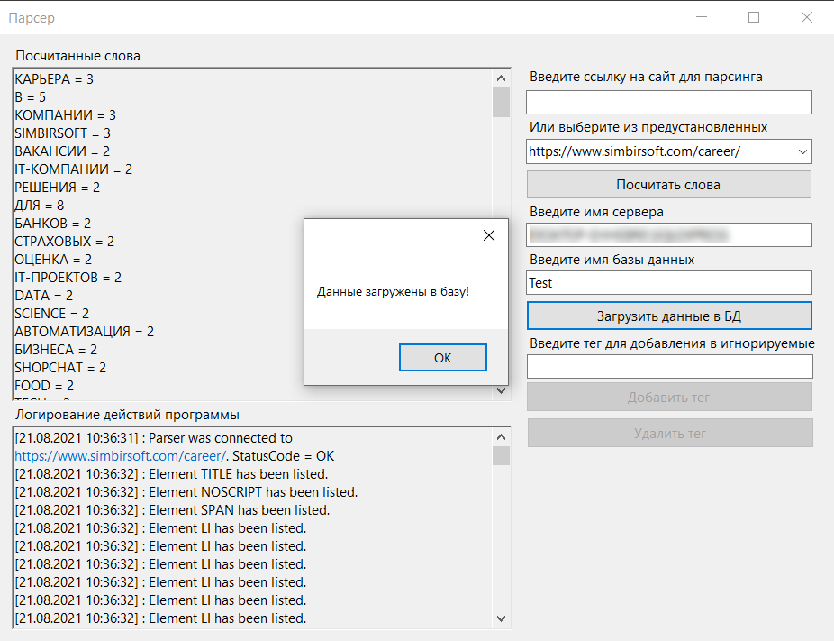

<h1>Парсер</h1>
  Приложение, которое позволяет парсить произвольную HTML-страницу и выдает статистику по количеству уникальных слов. 
А так же предоставляет возможность переноса результатов парсинга и подсчета слов в базу данных MS SQL Server. Для большей гибкости добавлена возможность добавить
тег в игнорируемы. При этом программа будет пропускать игнорируемые теги и не будет получать из них информацию, но будет продолжать считывать
дочерние теги DOM дерева. Для отслеживания работы программы все действия записываются в Лог-файл.

<hr>

<h1>Инструкция</h1>
<h2>1. Парсинг и подсчет количества слов</h2>

  При запуске программы отображается главное меню. Здесь пользователю предлагается заполнить поля для дальнейшей работы программы.


  В поле "Введите ссылку на сайт для парсинга" указывается ссылка на сайт, который будет обрабатываться программой. Также можно выбрать сайт в поле "Или выберите из предустановленных". В этом списке доступно 4 сайта по умолчанию: 
  
1. SimbirSoft.com
2. Microsoft.com
3. StackOverflow.com
4. Coderoad.ru

  После выбора сайта станет доступной кнопка "Посчитать слова". После нажатия на неё в поле "Посчитаные слова" отобразятся слова и их количество в тексте страницы. А в поле "Логирование действий программы" будет показано содержимое лог-файла, в котором записываются все действая программы: успешность подключения к сайту, какие теги были считаны, какую текстовую информацию они содержали и каким образом текст был разбит на слова.
  
  

<h2>2. Работа с базой данных</h2>
  
  После заполнения поля "Посчитанные слова" данные о словах и их количестве можно перенести в базу данных MS SQL Server. Для этого нужно указать имя сервера в поле "Введите имя сервера" и имя базы данных в поле "Введите имя базы данных". После заполнения указанных полей станет доступна кнопка загрузить данные в БД, по нажатию которой произойдет подключение к указанной базе. В базе автоматически будет создана новая таблица "CountedWords". Она будет заполнена данными из поля "Посчитанные слова". Если таблица уже существует, программа добавит данные в неё.
  
  
  
  <h2>3. Добавление тега в игнорируемые</h2>
  
  Программа также предоставляет возможность добавить желаемый тег в игнорируемые. Для этого нужно заполнить поле "Введите тег для добавление в игнорируемые", после чего станут доступны кнопки "Добавить тег" и "Удалить тег". По нажатию одной из них тег будет соответсвенно добавлен или удален в список игнорируемых. Игнорируемые теги не просматриваются программой и содержащаяся в них информация не будет учитываться при посчете слов, но дочерние теги игнорируемых всё так же будут обработаны программой.
  
  
  
  <hr>
  
  <h1>Руководство программиста</h1>
  
  Описание всех папок, классов, интерфейсов и методов программы.
  
  <h2>1. Папка "DBConnection"</h2>
  
  В этой папке содержатся все файлы отвечающие за подключение и загрузку данных в базу данных. 
  
  <h3>Класс "DBConnector"</h3>
  
  Основной класс "DBConnector" отвечает за подключение к бд и передачи данных в неё. Класс имеет конструктор с единственным параметором "settings" с типом "IDBSettigs" (Подробнее об этом интерфейсе будет сказано ниже). После инициализации конструктора будет создано подключение в соответствии с переданными в параметрах настройками.
  
  Метод "FillTableWithData" получает в качестве аргумента словарь "countedWords", который содержит слова и их количество. Далее он проверяет существует ли таблица "CountedWords" в базе данных и ,если не существует, создает её. После этого в он вносит все данные из словаря в указанную таблицу.
  
  ```
  public void FillTableWithData(Dictionary<string, int> countedWords)
        {
            try
            {
                if (!TableAlreadyExists())
                {
                    CreateTable();
                }
                foreach (var word in countedWords)
                {
                    string comandSting = $"INSERT INTO CountedWords (Word,Count) VALUES (\'{word.Key}\',{word.Value})";
                    ExecuteCommand(comandSting);
                }
            }
            catch (Exception ex)
            {
                Logger.WriteLog($"Failed to load data into table. [ {ex.Message} ]");
            }
        }
  ```
  
  Метод "CreateTable" создает таблицу "CountedWords" в базе данных. Таблица имеет два атрибута: "Word" типа "varchar" и "Count" типа "int".
  
  ```
  void CreateTable()
        {
            string comandString = "CREATE TABLE dbo.CountedWords"
           + "(Word varchar(255) NOT NULL,"
           + "Count int NOT NULL);";
            ExecuteCommand(comandString);
        }
   ```     

Метод "TableAlreadyExist" проверяет, существует ли уже таблица с именем "CountedWords" в базе данных. Он получает список таблиц базы и проверяет соответсвие названий существующих таблиц и "CountedWords"

```
bool TableAlreadyExists()
        {
            DataTable schemaTable = connection.GetSchema("Tables");
            foreach (DataRow r in schemaTable.Rows)
            {
                if ((string)r[2] == "CountedWords")
                    return true;
            }
            return false;
        }
```

Метод "ExecuteCommand" получает на вход SQL запрос в виде строки и с помощью адаптера выполняет переданную команду на SQL сервере.

```
void ExecuteCommand(string commandString)
        {
            try
            {
                SqlCommand cmd = new SqlCommand(commandString, connection);
                SqlDataAdapter adapter = new SqlDataAdapter(cmd);
                DataTable DT = new DataTable();
                adapter.Fill(DT);
                Logger.WriteLog($"Command {commandString} was executed.");
            }
            catch (Exception ex)
            {
                Logger.WriteLog($"Command {commandString} was not executed. [ {ex.Message} ]");
            }
        }
```

Два метода "OpenConnection" и "CloseConnection" соответсвенно открывают и закрывают соединение с базой данных.

```
        public void OpenConnection()
        {
            try
            {
                if (connection.State == ConnectionState.Closed)
                {
                    connection.Open();
                    Logger.WriteLog("Database connection opened.");
                }
            }
            catch (Exception ex)
            {
                Logger.WriteLog($"Failed to open connection. Check the server name. [{ex.Message}]");
            }
        }
```

```
        public void CloseConnection()
        {
            try
            {
                if (connection.State == ConnectionState.Open)
                {
                    connection.Close();
                    Logger.WriteLog("Database connection closed.");
                }
            }
            catch (Exception ex)
            {
                Logger.WriteLog($"Failed to close connection. [{ex.Message}]");
            }
        }
```

<h3>Интерфейс "IDBSettings"</h3>

Интерфейс содержит свойство "ConnectionString". Оно преднозначено для хранения данных о базе к которой необходимо подключиться. Благодаря этому уровню абстракции появляется возможность реализовать дополнительные варианты подключения к базе, например установить вход только для конкретных пользователей или установить дополнительные настройки безопасности. Все наследники этого интерфейса хранятся в папке "DBSettings". В ней содержится класс "ModifableDBSettings", в котором реализован простейший вариант подключения (Подробнее о нем будет сказано ниже).

```
public interface IDBSettings
    {
        public string ConnectionString { get; set; }
    }
```
<h3>Класс "ModifableDBSettings"</h3>

Класс является наследником интерфейста "IDBSettings" и содержит конструктор, который принемает на вход две переменные типа "string" с название сервера и названием базы данных. Из них строится строка подключения к базе данных.

```
string connectionString = "";

        public ModifiableDBSettings(string servername,string database)
        {
            connectionString = @$"Data Source={servername};Initial Catalog={database};Integrated Security=True";
        }
```

Доступ к этому полю осуществляется с помощью свойства "ConnectionString". Свойство должны реализовать все наследники "IDBSettings".

```
public string ConnectionString
        {
            get
            {
                return connectionString;
            }
            set
            {
                connectionString = value;
            }
        }
```
<h2>2. Папка "Html"</h2>

<h3>Класс "HtmlLoader"</h3>

Класс отвечает за подключение к обрабатываемому сайту и получении с него информации. 

Класс имеет два поля. Поле "client" типа "HttpClient", который содержит экземпляр класса, позволяющего отправлять Http-запросы и получать Http-ответы от интернет ресурсов. Поле "url" типа "string" содержащего ссылку на обрабатываемый сайт. 

```
        HttpClient client;
        string url;
```

Класс имеет конструктор с одном параметром "settings" типа "IPArserSettings.При инициализации экземпляра класса также заполняется поле "client", а полу "url" задается знаечение в соответсвии с переданными настройками парсера.

```
public HtmlLoader(IParserSettings settings)
        {
            client = new HttpClient();
            url = settings.BaseUrl;
        }
```

Асинхронный метод "GetSource" позволяет получить Html-код обрабатываемого сайта в виде строки. Сначала на сайт посылается запрос методом "GetAsync". Полученный ответ со всей информацией о сайте, включая html-код записывается в переменную "response". Далее проверяется успешность посланного запроса. Если запрос выполнен успешно, то в переменную source записывается html-код из общей информации ответа сайта.

```
ublic async Task<string> GetSource()
        {
            string source = null;
            try
            {
                var response = await client.GetAsync(url);

                if (response != null && response.StatusCode == HttpStatusCode.OK)
                {
                    source = await response.Content.ReadAsStringAsync();
                    Logger.WriteLog($"Parser was connected to {url}. StatusCode = {response.StatusCode}");
                }
                else
                {
                    Logger.WriteLog($"Parser wasn't connected to {url}. StatusCode = {response.StatusCode}");
                }

            }
            catch (Exception ex)
            {
                Logger.WriteLog($"Parser wasn't connected to {url}. [{ex.Message}]");
            }

            return source;
        }
```

<h2>3. Папка "Log"</h2>

<h3>Класс "Logger"</h3>

Класс отвечает за логирование дейтвий программы. В исходных файлах проекта существует файл "LogFile.txt" куда и записываются все действия программы с указание даты и времени произведенного действия.

```
public static void WriteLog(string message)
        {
            string logPath = "LogFile.txt";

            using(StreamWriter writer = new StreamWriter(logPath, true))
            {
                writer.WriteLine($"[{DateTime.Now}] : {message}");
            }
        }
```

<h2>4. Папка "Parser"</h2>

<h3>Интерфейс "IParser"</h3>

Интерфейс содержит метод параметрезированный "Parser". Параметризация позволяет парсить различные типы данных. На вход метод получает аргумент "document" типа "IHtmlDocument", который содержит DOM-дерево обрабатываемой страницы. Благодаря этому уровню абстракции появляется возможность реализовать разные варианты парсинга, наприметь создать парсер для обработки числовой информации с сайта. Эти классы хранятся в папке "Parsers". Сейчас реализован только простейший класс "SimpleParser". Он позволяет получить текстовую информацию кажнодого незапрещенного тега DOM-дерева (Подробнее о нем будет сказано ниже).

```
interface IParser<T> where T : class
    {
        T Parse(IHtmlDocument documet);
    }
}
```

<h3>Интерфейс "IParserSettings"</h3>

  Интерфейс содержит свойство "BaseUrl", которое содержит информацию о Url-адресе обрабатываемой страницы. Благодаря этому уровню абстракции появляется возможность реализовать разные настройки парсинга, например можно добавить возможность парсить новосные сайты с большим количеством страниц, добавив префикс с номером страницы к базовой ссылке. Классы с настройками парсера хранятся в папке "ParserSettings". Сейчас реализован класс "LinkOnlyParserSettings" с возможностью указания только Url-Адреса обрабатываемой страницы (Подробнее о нем будет сказано ниже).
  
```
public interface IParserSettings
    {
        string BaseUrl { get; set; }
    }
```

<h3> Класс "SimpleParser"</h3>

Класс реализует интерфейс "IParser". Он предоставляет функции для парсинга html-страницы и получения текстовой информации её элементов.

Метод "Parse" получает аргумент "document" типа "IHtmlDocument", который содержит DOM-дерево обрабатываемой страницы. В список "text" будет вноситься текстовая информация из элементов DOM-дерева. Переменная "html" содержит первый элемент дерева, который далее передается в рекурсивный метод "GetAllElements" в качестве начальной вершины для прохождения по дереву. Тут же заполняется список запрещенных тегов "forbidenTags". Список запрещенных тегов хранится в папке проекта в файле "ForbidenTags.txt".Теги из этого списка игнорируются программой, они не попадают в результирующий список елементов, возвращаемый методом "GetAllElements". После того как метод "GetAllElements" записал все элементы дом дерева в список "elementsOfDocument" свойство "TextContent" каждого элемента этого списка записывается в список "text". После того как были обработыны все элементы дерева метод возвращает список "text".

```
public string[] Parse(IHtmlDocument document)
        {
            List<string> text = new List<string>();
            var html = document.Body.ParentElement;

            using (StreamReader sr = new StreamReader("IgnoredTags.txt"))
            {
                while (!sr.EndOfStream)
                {
                    forbidenTags.Add(sr.ReadLine());
                }
            }

            List<IElement> elementsOfDocument = new List<IElement>();
            GetAllElements(html, elementsOfDocument);

            foreach (var element in elementsOfDocument)
            {
                try
                {
                    text.Add(element.TextContent);
                    Logger.WriteLog($"Text Content of Tag {element.TagName} has been listed. [ \"{element.TextContent}\" ]");
                }
                catch (Exception ex)
                {
                    Logger.WriteLog($"Text Content of Tag {element.TagName} hasn't been listed with error. [ {ex.Message} ]");
                }
            }

            return text.ToArray();
        }
```

Рекурсивный метод "GetAllElements" принимает на вход два аргумента "element" типа "IElement", который содержит проверяемую вершину дерева, и список "elements" типа  "IElement", в который он заносит пройденные незапрезенные елементы дерева. Каждый елемент дерева проверяется на запрещенность методом "TagIsNotForbiden" и, если элемент является списком, проверяется на вложенность методом "AreNotNestedList". Если тег не находится в списке запрещенных или не является вложенным списком, то он добавляется в список "elements".
 
  
```
static void GetAllElements(IElement element, List<IElement> elements)
        {
            if (TagIsNotForbiden(element) & AreNotNestedList(element))
            {
                try
                {
                    elements.Add(element);
                    Logger.WriteLog($"Element {element.TagName} has been listed.");
                }
                catch (Exception ex)
                {
                    Logger.WriteLog($"Element {element.TagName} hasn't been listed with error. [ {ex.Message} ]");
                }
            }

            foreach (var child in element.Children)
            {
                GetAllElements(child, elements);
            }
        }
```
  
Метод "TagIsNotForbiden" проверяет переданный ему в аргументы элемент на принадлежность к списку запрещеннных.

```
static bool TagIsNotForbiden(IElement element)
        {
            var tag = element.TagName.ToUpper();
            return !forbidenTags.Contains(tag);
        }
```

Метод "AreNotNestedList" проверяет элемент являющиеся списками на вложенность. Если если элементы списка так же являются списками, внешний список будет пропущен программой во избежание дублирования информации.

```
static bool AreNotNestedList(IElement element)
        {
            if(element.TagName.ToUpper()=="LI")
            {
                string[] listTags = { "UL", "OL", "DL" };
                foreach (string tag in listTags)
                    foreach (var child in element.Children)
                        if (child.TagName.ToUpper() == tag)
                            return false;
            }
                return true;
        }
```

<h3>Класс "LinkOnlyParserSettings"</h3>

Класс является наследником интерфейса "IParserSettings" и имеет конструктор, принимающий на вход ссылку на сайт для обработки.

```
string baseUrl;
        public LinkOnlyParserSettings(string BaseUrl)
        {
            baseUrl = BaseUrl;
        }
```

Так же реализует наследуемое свойство для доступа к полю, хранящему ссылку.

```
public string BaseUrl
        {
            get
            {
                return baseUrl;
            }
            set
            {
                baseUrl = value;
            }
        }
```

<h3>Класс "ParserWorker"</h3>

Класс использует приведенные выше классы из папки "Parser", а так же использует класс "HtmlLoader" для получения информации с обрабатываемого сайта и выделения текстовой информации с него.

Класс имеет три поля. Поле "parser" типа "IParser", в котором хранится экземпляр конкретного парсера. В зависимости от переданного в аргументы конструктора экземпляра класса можно изменить способ обработки сайта. Поле "parserSettings" типа "IPArserSettings,которое содержит информацию о настройках парсера. Поле "loader" типа "HtmlLoader", которое содержит экземпляр класса, отвечающего за подключение к сайту.

```
        IParser<T> parser;
        IParserSettings parserSettings;
        HtmlLoader loader;
```

Класс имеет два конструктора. Первый на вход получает один аргумент "parser" типа "IParser".

```
        public ParserWorker(IParser<T> parser)
        {
            this.parser = parser;
        }
```

Второй имеет два аргумента. Один аргумент "parser" типа "IParser". Второй аргумент "parserSettings" типа "IPArserSettings". При инициализации экземпляра калсса эти конструктором сразу устанавливается значени поля "loader" и происходит подключение к сайту, установленному в настройках парсера.

```
        public ParserWorker(IParser<T> parser, IParserSettings parserSettings)
            : this(parser)
        {
            this.parserSettings = parserSettings;
            loader = new HtmlLoader(parserSettings);
        }
```

Событие "OnNewData" используется для получения результата работы асинхронного метода "Worker". Так как на подключение к сайту и обработка полученной информации может быть затрачено довольно большое количество времени удобнее использовать свойство для возвращении результата работы. Это позволит продолжить работу с приложение, пока ожидается ответ от сайта.

```
public event Action<T> OnNewData;
```

Асинхронный метод "Worker" посылает запрос на обрабатываемый сайт методом "GetSource"(Его описание будет представлено ниже). В результате его работы html-код обрабатываемого сайта записывается в переменную "source" в виде строки. После получения ответа с сайта создается экземпляр класса "HtmlParser" из библиотеки "AngleSharp". С помощью метода "ParseDocumentAsync" из этой библиотеки в переменную "Document" записывается информация о DOM-дереве, полученной парсингом html-кода из переменной "source". Далее из каждого элемента DOM-дерева извлекается текстовая информация, и результат работы метода возвращается с помощью активирования события OnNewData.

```
public async void Worker()
        {
            try
            {
                var source = await loader.GetSource();
                var domParser = new HtmlParser();
                var document = await domParser.ParseDocumentAsync(source);
                var result = parser.Parse(document);
                Logger.WriteLog($"The page was parsed.");
                OnNewData?.Invoke(result);
            }
            catch (Exception ex)
            {
                Logger.WriteLog($"The page was not parsed due to an error. [{ex.Message}]");
            }
        }
```

<h2>5. Папка "StringProcessing"</h2>

<h3>Класс "WordCounter"</h3>

Класс отвечает за подсчет колличества слов, которые были полученны в результате парсинга сайта. 

Метод "GetCountedWords" подсчитывает количество слов из переданного ему массива "text" типа "string". Сначала он разбивает массив предложений на отдельные слова методом "SeparateWords". Далее создается словарь, ключами в котором буду разделенный слова, а значениями количество этих слов. Каждое слово переводится в верхний регистр чтобы посчитать все уникальные слов без зависимости от регистра.

```
public static Dictionary<string, int> GetCountedWords(string[] text)
        {
            var words = SeparateWords(text);
            var countedWordsList = new Dictionary<string, int>();

            for (int i = 0; i < words.Length; i++)
            {
                var upstringWord = words[i].ToUpper();
                try
                {
                    if (countedWordsList.Keys.Contains(upstringWord))
                        countedWordsList[upstringWord]++; 
                    else
                        countedWordsList.Add(upstringWord, 1);
                    
                }
                catch(Exception ex)
                {
                    Logger.WriteLog($"The word could not be counted due to an error. [ {ex.Message} ]");
                }
            }
            return countedWordsList;
        }
```

Метод "SeparateWors" отделяет слова друг от друга из переданного ему массива "text" типа "string" с помощью списка разделителей. Каждый элемент списка разделяется на слова методом "Split", а затем из строки дополнительно удаляются пробелы методом "DeleteWhiteSpace". После разделения каждое слово записывается в выходной список, который и возвращает данный метод. 

```
static string[] SeparateWords(string[] text)
        {
            var words = new List<string>();
            var separators = new char[] { ' ', ',', '.','\'', '!', '?', '"', ';', ':', '[', ']', '(', ')', '«', '»', '—', '\n', '\r', '\t' };
            foreach (var sentence in text)
            {
                try
                {
                    var splitedSentence = sentence.Split(separators);
                    var clearedSentence = DeleteWhiteSpace(splitedSentence);
                    Logger.WriteLog($"The sentence was divided into words. {String.Join(",",clearedSentence)}");
                    foreach (var word in clearedSentence)
                    {
                        words.Add(word);
                    }
                }
                catch(Exception ex)
                {
                    Logger.WriteLog($"The sentence wasn't divided into words. [ {ex.Message} ]");
                }
            }
            return words.ToArray();
        }
```

Метод "DeleteWhiteSpace" удаляет пустые строки из массива "text" типа "string" переданного ему в качестве аргумента.

```
static string [] DeleteWhiteSpace(string[] text)
        {
            return text.Where(x => !string.IsNullOrWhiteSpace(x)).ToArray();
        }
```
